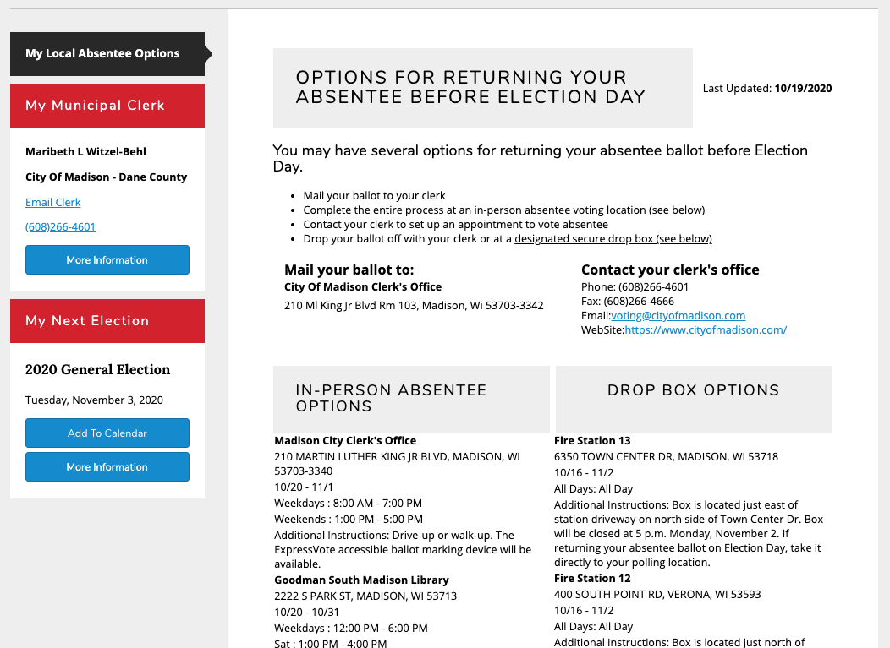
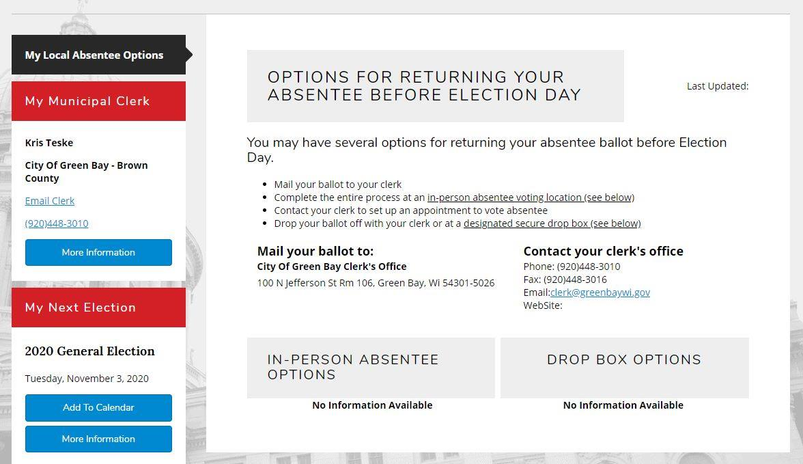

```{r setup, include=FALSE}
knitr::opts_chunk$set(echo = TRUE, 
                      cache = FALSE, 
                      #fig.width=8.5, 
                      split = T,
                      fig.align = 'center', 
                      fig.path='figs/',
                      warning=FALSE, 
                      message=FALSE)

library(httr)
library(jsonlite)
library(tidyverse)
library(magrittr)
library(here)
library(knitr)
library(kableExtra)
library(rvest)

kablebox <- . %>%  knitr::kable() %>% 
  kable_styling() %>% 
  scroll_box(height = "200px")
```

> Note: Below are **election day** polling places. For early voting (October 20-30) and ballot drop box locations, go to [iwillvote.com](https://iwillvote.com/locate/?state=WI)

The Elections Commission and Municipal Clerks are generally working hard and earnestly to help people vote with too few resources, and resources are unevenly distributed, and a rapidly changing legal environment where groups fight to make it easier or harder for people to vote.

# Polling Places from the Wisconsin Elections Commission

```{r}
# UPDATE THIS IF A NEW FILE IS POSTED! 
file <- "Polling Place Locations - 2020 General Election Updated 10-21-2020.xlsx"

official_locations <- readxl::read_xlsx(here::here("data", file))

date <- "10-21-2020"
```

This analysis uses the "`r file`" data posted on `r date`. Here are the current files posted on https://elections.wi.gov/node/6976:

```{r}
# polling locations posted on website
html <- read_html("https://elections.wi.gov/node/6976") %>%
  html_nodes("a") 

files <- tibble(file = html_text(html),
                link = html_attr(html, "href")) %>% 
  filter(str_detect(file, "xls|csv")) 
                
kable(files) %>% 
  kable_styling() %>% 
  scroll_box()
``` 

---

# Changes from the August Primary Election

```{r}
old_locations <- readxl::read_xlsx(here::here("data", "PPL 2020 Partisan Primary 2.xlsx")) %>% 
  select(County, Muni, ReportingUnit, PollingPlaceName, PollingPlaceAddress, Longitude, Latitude)

# a function to split out wards
split <- function(ward){
  
  min = str_extract(ward, "[0-9]*") %>% 
           as.numeric()
  
  max = str_extract(ward, "-[0-9]*") %>% 
           as.numeric() %>% abs()
  
  full_seq(c(min,
             max),
           1) %>%
    str_c(collapse = ",") 
}

# split out wards
split_wards <- . %>%
  mutate_if(is.character, str_to_upper) %>% 
  mutate(ward = str_extract(ReportingUnit, "[1-9].*") %>% 
           # split on commas in wards
           str_split(",")) %>% 
  unnest(ward) %>% 
  # remove any letters
  mutate(ward = ward %>% str_remove("[A-z]")) %>% 
  # make a sequence of wards
  mutate(ward_seq = map_chr(ward, possibly(split, otherwise = NA)),
         ward = coalesce(ward_seq, ward) %>% 
           str_split(",")) %>% 
  unnest(ward) %>% 
  mutate_if(is.character, str_to_title) %>%
  mutate(County = str_remove(County, " County") %>% str_remove("\\.")) %>%
  mutate(ReportingUnit = paste("Ward ", ward)) %>% 
  ungroup() %>% 
  select(-ward_seq)


# apply function to old and new polling locations
official <- official_locations %>% split_wards()
old <- old_locations %>% split_wards()

# diff between old and new polling locations
diff <- anti_join(official, old, 
                  by = c("County", "Muni", "ReportingUnit", 
                         "ward", "PollingPlaceAddress")) %>%
  left_join(old, 
            by = c("County", "Muni", "ReportingUnit", "ward"),
            suffix = c(".General", ".Primary"))

# calculate the total and net number of changes
diff %<>% 
  group_by(County)%>% 
  mutate(changes = length(unique(PollingPlaceAddress.General)),
         net = changes - length(unique(PollingPlaceAddress.Primary))) 

# simplify polling place names + addresses 
diff %<>% mutate(General = str_c(PollingPlaceName.General, 
                                 PollingPlaceAddress.General, 
                                 sep = ", "),
                 Primary = str_c(PollingPlaceName.Primary, 
                                 PollingPlaceAddress.Primary, 
                                 sep = ", "))
```


```{r map_change}
wi <- map_data("county", "wisconsin") %>% 
  mutate(County = str_to_title(subregion) ) %>% 
  group_by(subregion) %>%
  # Find the center of each subregion
  mutate(center_lat = mean(range(lat) ),
         center_long = mean(range(long) ) )

wi  %<>% 
  # add total and net changes to map data
  left_join(diff %>% 
              select(County, Muni, PollingPlaceAddress.General, changes, net) ) %>% 
  # append polling location points 
  full_join(diff %>% mutate(group = NA)) %>% 
  mutate(changes = changes %>% replace_na(0),
         net = net %>% replace_na(0)) 

# plot changes 
wi %>% 
  ggplot( ) +
  aes(x = long, y = lat, group = group, fill = factor(changes)) +
  geom_polygon(color = "white") +
  geom_point(aes(x = Longitude.Primary, 
                 y = Latitude.Primary), 
             color = "Red", alpha = .5) +
  geom_point(aes(x = Longitude.General, 
                 y = Latitude.General), 
             color = "Green", shape = "+", size = 5, alpha = .5) + 
  # label counties at their center
  geom_text( aes(x = center_long, y = center_lat, label = County), 
             size = 2, angle = 45, check_overlap = T, color = "white") +
  theme_void() + 
  labs(fill = "Polling Place\nAddresses Changed\nper County") +
  scale_fill_manual(values = colorRampPalette(c("#6BAED6", "#08306B"))(14))
```

New polling locations are green. Removed locations are red. Brighter points mean that more Wards moved to or from that polling location. 

These data have a few errors. For example, red dots in Rusk and Jackson counties are the result of latitude or longitude typos, but these points are mostly correct. A few of these "changes" are the result of errors in the Elections Commission's August file. For example, the polling location addresses for the Town of Dewey and Town of Sharon are simply incorrect in the August Primary Election file.

```{r map_net}
# net 
wi %>% 
ggplot() +
  aes(x = long, y = lat, group = group, fill = factor(net)) + 
  geom_polygon(color = "white") +
  geom_point(aes(x = Longitude.Primary, 
                 y = Latitude.Primary), 
             color = "Red", alpha = .5) +
  geom_point(aes(x = Longitude.General, 
                 y = Latitude.General), 
             color = "Green", shape = "+", size = 5, alpha = .5) + 
  geom_text( aes(x = center_long, y = center_lat, label = County), 
             size = 2, angle = 45, check_overlap = T, color = "white") +
  theme_void() + 
  labs(fill = "Net Polling Places\nAdded per County") +
  scale_fill_brewer(direction = -1) 
```

#### Green Bay (Brown County) and Burlington (Racine County) now have even *fewer* polling places than they did for the August Primary election. 

On September 15th, Green Bay's City Council [voted](https://greenbaywi.civicclerk.com/Web/Player.aspx?id=6914&key=-1&mod=-1&mk=-1&nov=0) to consolidate Wards 6, 7, 9, & 14 (who voted at Danz Elementry in the August Primary) and Wards 22 & 23 (who voted at Curative Connections). These Wards now all vote at the Bay Beach Amusement Park. Danz Elementary is 68% Latinx and 85% economically disadvantaged. By [law](https://docs.legis.wisconsin.gov/document/statutes/2003/5.25(3)), polling places may not be removed within 60 days of a general election.  [Green bay has received grants](https://www.greenbaypressgazette.com/story/news/2020/09/24/wisconsin-election-green-bay-lines-up-polling-places-pushes-absentee-voting/5810372002/) to keep polls open but still has *just over half* of its usual number of polling places.

Burlington Wards 1-4 voted at Cross Lutheran Church in the Primary. They now vote with Wards 5-8 at the Veterans Memorial Building.


```{r}
# table of changes 
diff %>% 
  ungroup( ) %>%
  group_by(County, Muni, General, Primary) %>% 
  summarise(Ward = paste(County, Muni, "Ward", 
                         paste(ward, collapse = ", "),
                         sep = ", ")) %>%
  ungroup() %>% 
  select(Ward, Primary, General) %>%  
  distinct() %>% 
  knitr::kable() %>% 
  kable_styling() %>% 
  scroll_box(height = "500px")
```

```{r map_county}
# a function to plot each county
countymap <- function(county){
p <- wi %>% 
  filter(County == county) %>% 
ggplot() +
  geom_polygon(aes(x = long, y = lat, group = group), fill = "#08306B") +
  geom_point(aes(x = Longitude.Primary, 
                 y = Latitude.Primary), 
             color = "Red", alpha = .5) +
  geom_point(aes(x = Longitude.General, 
                 y = Latitude.General), 
             color = "Green", shape = "+", size = 5, alpha = .5) + 
  geom_text( aes(x = Longitude.Primary, 
                 y = Latitude.Primary,
                 label = PollingPlaceName.Primary), 
             color = "Red", alpha = .5, 
             angle = 45, check_overlap = T) +
    geom_text( aes(x = Longitude.General, 
                 y = Latitude.General,
                 label = PollingPlaceName.General), 
             color = "Green", alpha = .5, 
             angle = 45, check_overlap = T) +
  geom_segment(aes(x = Longitude.Primary,
                   y = Latitude.Primary,
                   xend = Longitude.General, 
                   yend = Latitude.General), 
                #arrow = arrow(length = unit(0.1, "cm")),
               color = "green") + 
  geom_text( aes(x = Longitude.General, 
                 y = Latitude.General,
                 label = PollingPlaceName.General), 
             color = "Green", alpha = .5, 
             angle = 45, check_overlap = T) +
  theme_void() + 
  labs(title = paste(county, "County"))

return(p)
}

map(diff %>%
      filter(net != 0 | changes > 6) %>%
      .$County %>% 
      unique(),
    countymap) 
```


---

# Changes since October 7th, 2020

By law, polling locations are [not supposed to change](https://docs.legis.wisconsin.gov/document/statutes/2003/5.25(3)) in the 60 days before a general election but `¯\_(ツ)_/¯` 

The Election Commission's [guidance](https://elections.wi.gov/clerks/guidance/accessibility/new-polling-place) just says 30 days, but Wisconsin Statute 5.25(3) specifies 60 days for general elections.

>"Polling places shall be established for each September primary and general election at least 60 days before the election, and for each other election at least 30 days before the election." - [Wisconsin Statute 5.25(3)](https://docs.legis.wisconsin.gov/document/statutes/2003/5.25(3))

```{r}
oct_locations <- readxl::read_xlsx(here::here("data", "2020 General Election PPL RU List.xlsx")) %>% 
  select(County, Muni, ReportingUnit, PollingPlaceName, PollingPlaceAddress, Longitude, Latitude)

# apply function to old polling locations
oct <- oct_locations %>% split_wards()

# diff between old and new polling locations
diff <- anti_join(official, oct, 
                  by = c("County", "Muni", "ReportingUnit", 
                         "ward", "PollingPlaceAddress")) %>%
  left_join(oct, 
            by = c("County", "Muni", "ReportingUnit", "ward"),
            suffix = c(".October21", ".October7"))

# calculate the total and net number of changes
diff %<>% 
  group_by(County)%>% 
  mutate(changes = length(unique(PollingPlaceAddress.October21)),
         net = changes - length(unique(PollingPlaceAddress.October7))) 

# simplify polling place names + addresses 
diff %<>% mutate(October21 = str_c(PollingPlaceName.October21, 
                                 PollingPlaceAddress.October21, 
                                 sep = ", "),
                 October7 = str_c(PollingPlaceName.October7, 
                                 PollingPlaceAddress.October7, 
                                 sep = ", "))
```


```{r map_change_october}
wi <- map_data("county", "wisconsin") %>% 
  mutate(County = str_to_title(subregion) ) %>% 
  group_by(subregion) %>%
  # Find the center of each subregion
  mutate(center_lat = mean(range(lat) ),
         center_long = mean(range(long) ) )

wi  %<>% 
  # add total and net changes to map data
  left_join(diff %>% 
              select(County, Muni, PollingPlaceAddress.October21, changes, net) ) %>% 
  # append polling location points 
  full_join(diff %>% mutate(group = NA)) %>% 
  mutate(changes = changes %>% replace_na(0),
         net = net %>% replace_na(0)) 

# plot changes 
wi %>% 
  ggplot( ) +
  aes(x = long, y = lat, group = group, fill = factor(changes)) +
  geom_polygon(color = "white") +
  geom_point(aes(x = Longitude.October7, 
                 y = Latitude.October7), 
             color = "Red", alpha = .5) +
  geom_point(aes(x = Longitude.October21, 
                 y = Latitude.October21), 
             color = "Green", shape = "+", size = 5, alpha = .5) + 
  # label counties at their center
  geom_text( aes(x = center_long, y = center_lat, label = County), 
             size = 2, angle = 45, check_overlap = T, color = "white") +
  theme_void() + 
  labs(fill = "Polling Place\nAddresses Changed\nper County Between\nOct. 7 and Oct. 21 2020") +
  scale_fill_brewer(direction = -1) 
```

New polling locations are green. Removed locations are red. Brighter points mean that more Wards moved to or from that polling location. 


```{r map_net_october}
# net 
wi %>% 
ggplot() +
  aes(x = long, y = lat, group = group, fill = factor(net)) + 
  geom_polygon(color = "white") +
  geom_point(aes(x = Longitude.October7, 
                 y = Latitude.October7), 
             color = "Red", alpha = .5) +
  geom_point(aes(x = Longitude.October21, 
                 y = Latitude.October21), 
             color = "Green", shape = "+", size = 5, alpha = .5) + 
  geom_text( aes(x = center_long, y = center_lat, label = County), 
             size = 2, angle = 45, check_overlap = T, color = "white") +
  theme_void() + 
  labs(fill = "Net Polling Places\nAdded per County Between\nOct. 7 and Oct. 21 2020") +
  scale_fill_brewer(direction = -1) 
```


```{r}
# table of changes 
diff %>% 
  ungroup( ) %>%
  group_by(County, Muni, October21, October7) %>% 
  summarise(Ward = paste(County, Muni, "Ward", 
                         paste(ward, collapse = ", "),
                         sep = ", ")) %>%
  ungroup() %>% 
  select(Ward, October7, October21) %>%  
  distinct() %>% 
  knitr::kable() %>% 
  kable_styling() %>% 
  scroll_box(height = "500px")
```

```{r map_county_october}
# a function to plot each county
countymap <- function(county){
p <- wi %>% 
  filter(County == county) %>% 
ggplot() +
  geom_polygon(aes(x = long, y = lat, group = group), fill = "#08306B") +
  geom_point(aes(x = Longitude.October7, 
                 y = Latitude.October7), 
             color = "Red", alpha = .5) +
  geom_point(aes(x = Longitude.October21, 
                 y = Latitude.October21), 
             color = "Green", shape = "+", size = 5, alpha = .5) + 
  geom_text( aes(x = Longitude.October7, 
                 y = Latitude.October7,
                 label = PollingPlaceName.October7), 
             color = "Red", alpha = .5, 
             angle = 45, check_overlap = T) +
    geom_text( aes(x = Longitude.October21, 
                 y = Latitude.October21,
                 label = PollingPlaceName.October21), 
             color = "Green", alpha = .5, 
             angle = 45, check_overlap = T) +
  geom_segment(aes(x = Longitude.October7,
                   y = Latitude.October7,
                   xend = Longitude.October21, 
                   yend = Latitude.October21), 
                #arrow = arrow(length = unit(0.1, "cm")),
               color = "green") + 
  geom_text( aes(x = Longitude.October21, 
                 y = Latitude.October21,
                 label = PollingPlaceName.October21), 
             color = "Green", alpha = .5, 
             angle = 45, check_overlap = T) +
  theme_void() + 
  labs(title = paste(county, "County"))

return(p)
}

map(diff %>%
      filter(net != 0 | changes > 1) %>%
      .$County %>% 
      unique(),
    countymap) 
```

# Early voting and ballot drop boxes

> Note: Because the Election Commission's website, myvote.wi.gov, is incomplete, voters should go to [iwillvote.com](https://iwillvote.com/locate/?state=WI) for early voting and ballot drop box locations

To request an absentee ballot in Wisconsin, you must go to the Election Commission's website myvote.wi.gov. This site then shows voters their Early Voting (called "In-Person Absentee") and Drop Box options. The Election Commission relies on Municipal Clerks to provide this information. Unfortunately, even halfway through early voting, many municipalities have not yet provided this information. For example, Madison has, but Green Bay has not.

### myvote.wi.gov has options for Madison



### myvote.wi.gov lacks options for Green Bay




### myvote.wi.gov lacks early voting or drop box information for most municipalities 

```{r}
early <- read_csv(here("data", "Early Voting Sites - 2020 General Election.csv")) %>% 
  select(Muni) %>% 
  distinct() %>% 
  mutate(Muni = str_remove(Muni, " - .*"),
         early = "Early voting options listed")

drop <- read_csv(here("data", "Absentee Dropboxes - 2020 General Election.csv")) %>% 
  select(Muni) %>% 
  distinct() %>% 
  mutate(Muni = str_remove(Muni, " - .*"),
         drop = "Drop boxes listed")

# add to data
official_locations %<>% 
  # reformat county
  mutate(County = County %>% 
           str_to_title() %>% 
           str_remove(" County") ) %>% 
  left_join(early) %>% 
  left_join(drop) %>% 
  mutate(drop = drop %>% replace_na("No information"),
         early = early %>% replace_na("No information") )

# summary table 
official_locations %>% 
  select(Muni, early, drop) %>% 
  distinct() %>% 
  mutate(early = str_replace(early, "Early voting options listed", "Yes"),
         drop = str_replace(drop, "Drop boxes listed", "Yes")) %>%
count(early, drop) %>% 
  rename(`Early voting options listed` = early,
         `Drop boxes listed` = drop,
         `Municipalities` = n) %>% 
  kablebox()
```


```{r early}
# format map data 
wi <- map_data("county", "wisconsin") %>% 
  mutate(County = str_to_title(subregion) ) %>% 
  group_by(subregion) %>%
  # Find the center of each subregion
  mutate(center_lat = mean(range(lat) ),
         center_long = mean(range(long) ) )

# add full data to map
wi %<>% full_join(official_locations %>%
                    select(County, Muni, Longitude, Latitude, early, drop) %>% 
                    distinct() %>%
                    mutate(group  = NA) )

# early 
early_plot <- function(x){ 
ggplot(x) +
  aes(x = long, y = lat, group = group) + 
  geom_polygon(color = "white") +
  geom_point(aes(x = Longitude, 
                 y = Latitude,
                 color = early), 
             alpha = 900/nrow(x)) + 
  geom_text( aes(x = center_long, y = center_lat, label = County), 
             size = 2, angle = 45, check_overlap = T, color = "white") +
      geom_text( aes(x = Longitude, 
                 y = Latitude,
                 color = early,
                 label = Muni), 
             size = 200/nrow(x), vjust = -1, check_overlap = T) +
  theme_void() + 
  labs(color = "Early voting options\non myvote.wi.gov\nby polling place") +
  scale_color_brewer(palette = "Set2")
}

early_plot(wi)

early_plot(wi %>% filter(County == "Brown")) + labs(title = "Brown County")

early_plot(wi %>% filter(County == "Milwaukee")) + labs(title = "Milwaukee County")
```

```{r dropbox}
# drop boxes
drop_plot <- function(x){ 
ggplot(x) +
  aes(x = long, y = lat, group = group) + 
  geom_polygon(color = "white") +
  geom_point(aes(x = Longitude, 
                 y = Latitude,
                 color = drop), 
             alpha = 900/nrow(x)) + 
  geom_text( aes(x = center_long, y = center_lat, label = County), 
             size = 2, angle = 45, check_overlap = T, color = "white") +
      geom_text( aes(x = Longitude, 
                 y = Latitude,
                 color = drop,
                 label = Muni), 
             size = 200/nrow(x), vjust = -1, check_overlap = T) +
  theme_void() + 
  labs(color = "Ballot drop box options\non myvote.wi.gov\nby polling place") +
  scale_color_brewer(palette = "Set2")
}

drop_plot(wi)

drop_plot(wi %>% filter(County == "Brown")) + labs(title = "Brown County")
drop_plot(wi %>% filter(County == "Milwaukee")) + labs(title = "Milwaukee County")
```
<!---

# Polling place locations via Google Civic's API

(Actually, it goes Wisconsin Elections Commission -> Voter Information Project -> Google Civic's API)

To check that Google Civic is providing the same information that is posted on the Election Commission's website, we can look up polling locations for addresses in each voting precinct using the Google Civic API.

```{r}
#########################################################
# one address per precinct
addresses <- read_csv(here::here("data", "wisconsin_example_addresses.csv"))

addresses %<>% mutate_if(is.character, str_to_upper)

addresses %<>% arrange(county_name)

# FIXME DELETE THIS WHEN API IS WORKING
addresses %<>% head(2)
# /FIXME
```


Polling locations are sometimes (in the days or weeks before an election) available via the Google Civic API, which uses data collected from states by the Voter Information Project, which notifies users when it posts data here: https://groups.google.com/g/vip-community

Notes about the Google Civic API (see the relevant documentation [here](https://developers.google.com/civic-information/docs/v2/elections/voterInfoQuery))  
- create an API key here: https://console.developers.google.com/apis/credentials  
- remember to authorize you API key  
- API calls should not need `electionId`; docs say it is optional  
- `pollingLocations` will not always be returned  
- may return a great deal more than polling locations (see Additional Google Civic API Contents below)
- may return more than one polling place per input address as a list 


```{r}
# make full street address
addresses %<>% 
  mutate(voter_address = paste(voting_street_address,
                               voting_city, 
                               state_code))

addresses$voter_address[1]
```

Here is the polling place from the Google Civic API for the above address:
```{r, eval=FALSE}
# need to get AND authorize an API key
source(here::here("api_key.R"))

# A function to get poll addresses
get_poll <- function(voter_address){
  
  voter_address %<>% 
    str_replace_all(" ", "%20") %>%
    str_remove_all(",")
  
  url <- str_c("https://civicinfo.googleapis.com/civicinfo/v2/voterinfo?address=", 
               voter_address, 
               "&returnAllAvailableData=true&key=", 
               api_key)
  
  
  poll <- GET(url) %>% 
    .$content %>% 
    rawToChar() %>% 
    fromJSON() %>%
    .$pollingLocations %>% # note: there is a lot more than this
    .$address %>% 
    {ifelse(is.null(.), "NULL", .)}
  
  return(poll)
}


# test 
get_poll(addresses$voter_address[1])

# apply function to addresses
api_locations <- addresses %>% 
  # "NULL" if NULL, "error" if any error
  mutate(PollingPlaceAddress = voter_address %>% map(possibly(get_poll, "error"))) 

# expand if there is more then one polling place per address
api_locations %<>% unnest(PollingPlaceAddress)

api_locations %>% select(voting_street_address, precinct_name, precinct_id, PollingPlaceAddress) %>%  kablebox()
```

### API results not in the state's xlsx file

```{r, eval = FALSE}
api_locations %>% 
  filter(PollingPlaceAddress != "NULL") %>% # filter out API errors
  anti_join(official_locations) %>% # filter out locations already posted
  select(precinct_name, precinct_id, PollingPlaceAddress) %>%
  kablebox()
```

### Cases where Google Civic's API did not return the same address when given polling locations

> Until the API is working, it will be all addresses. I'm just showing a few for now.

```{r, eval=FALSE}
official_locations %>% 
  head() %>% #FIXME WHEN THE API IS WORKING
  mutate(PollingPlaceAddress_API = map(PollingPlaceAddress, get_poll)) %>% # get polling places for polling places' addresses
  filter(PollingPlaceAddress_API != PollingPlaceAddress) %>% # mismatches
  select(Muni, ReportingUnit, PollingPlaceName, PollingPlaceAddress, PollingPlaceAddress_API) %>%
  kablebox()
```

### Polling place addresses not returned by Google Civic's API

> Until the API is working, it will be all addresses. I'm just showing a few for now.

```{r,eval=FALSE}
official_locations %>% 
  head() %>% #FIXME WHEN THE API IS WORKING
  anti_join(api_locations) %>% # remove ones matched with API
  select(Muni, ReportingUnit, PollingPlaceName, PollingPlaceAddress) %>% 
  kablebox()
```

---


```{r, eval=FALSE}
# align official and Google Civic API results
api_locations %<>% rename(County = county_name)

# reformat county
official_locations %<>% 
  mutate_if(is.character, str_to_title) %>% 
  mutate(County = str_remove(County, " COUNTY") )


# locations <- full_join(official_locations, api_locations)
```


## Additional Google Civic API Contents

For reference, these values may or may not be returned: 
```
"pollingLocations": [
    {
      "id": string,
      "address": {
        "locationName": string,
        "line1": string,
        "line2": string,
        "line3": string,
        "city": string,
        "state": string,
        "zip": string
      },
      "notes": string,
      "pollingHours": string,
      "name": string,
      "voterServices": string,
      "startDate": string,
      "endDate": string,
      "latitude": double,
      "longitude": double,
      "sources": [
        {
          "name": string,
          "official": boolean
        }
      ]
    }
  ],
  "earlyVoteSites": [
    {
      "id": string,
      "address": {
        "locationName": string,
        "line1": string,
        "line2": string,
        "line3": string,
        "city": string,
        "state": string,
        "zip": string
      },
      "notes": string,
      "pollingHours": string,
      "name": string,
      "voterServices": string,
      "startDate": string,
      "endDate": string,
      "latitude": double,
      "longitude": double,
      "sources": [
        {
          "name": string,
          "official": boolean
        }
      ]
    }
  ],
  "dropOffLocations": [
    {
      "id": string,
      "address": {
        "locationName": string,
        "line1": string,
        "line2": string,
        "line3": string,
        "city": string,
        "state": string,
        "zip": string
      },
      "notes": string,
      "pollingHours": string,
      "name": string,
      "voterServices": string,
      "startDate": string,
      "endDate": string,
      "latitude": double,
      "longitude": double,
      "sources": [
        {
          "name": string,
          "official": boolean
        }
      ]
    }
  ],
```

-->